# Cisco Network Change Flow Analysis

面向 `netclaw` 仓库中 Cisco 相关能力，对“网络变更/割接”业务流程的底层设计做结构化拆解。

本文重点回答 4 个问题：

1. 针对网络变更，`NetClaw` 是如何组织 `Skills / MCP / Tools` 的？
2. 每一层分别承担什么职责？
3. 底层 `tools` 是如何设计的？有哪些大的设计维度？
4. 如果要给别人讲清楚 Cisco 这一套，应当怎么讲？

---

## 1. 一句话结论

`NetClaw` 并不是用一个“网络变更总工具”解决变更问题，而是把网络变更拆成多个分层能力：

- `Skill` 负责变更方法论与流程编排
- `MCP Server` 负责连接具体系统
- `Tool` 负责执行最小动作

在 Cisco 这一套里，最典型的网络变更链路是：

`ServiceNow Change Workflow -> pyATS Baseline / Apply / Verify -> Batfish Offline Validation -> NetBox SoT Reconcile -> GAIT Audit`

也就是说：

**网络变更不是单点操作，而是一个带门禁、基线、实施、验证、回退、审计的多阶段工作流。**

### 可视化：主链路一览

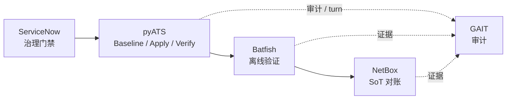

---

## 2. 三层结构：Skill / MCP / Tool

## 2.1 Skill 是“方法论层”

Skill 定义“怎么做”，不是直接执行器。

在网络变更流程里，最关键的 skill 有：

- `workspace/skills/servicenow-change-workflow/SKILL.md`
- `workspace/skills/pyats-config-mgmt/SKILL.md`
- `workspace/skills/pyats-health-check/SKILL.md`
- `workspace/skills/netbox-reconcile/SKILL.md`
- `workspace/skills/batfish-config-analysis/SKILL.md`
- `workspace/skills/gait-session-tracking/SKILL.md`

这些 skill 决定：

- 先查什么
- 后做什么
- 哪些条件下必须停止
- 哪些内容必须记录
- 哪些内容构成验证与回退依据

---

## 2.2 MCP 是“系统接入层”

MCP 负责连接真实系统。

变更相关最关键的 MCP 有：

- `pyATS MCP`：设备访问、show、config、ping、日志
- `ServiceNow MCP`：CR、approval、incident、task
- `Batfish MCP`：离线配置合法性与影响分析
- `NetBox MCP`：设计意图/Source of Truth
- `GAIT MCP`：审计轨迹

这层解决的是：

- 用什么协议/接口访问系统
- 如何把系统能力变成可调用工具

---

## 2.3 Tool 是“最小动作层”

Tool 是可执行的最小原子能力。

例如：

- `pyats_show_running_config`
- `pyats_run_show_command`
- `pyats_configure_device`
- `create_change_request`
- `submit_change_for_approval`
- `batfish_validate_config`
- `batfish_diff_configs`
- `netbox_get_objects`
- `gait_record_turn`

你可以把 tool 理解成：

**一个个被 Skill 调度的小能力单元。**

### 可视化：三层与调用关系

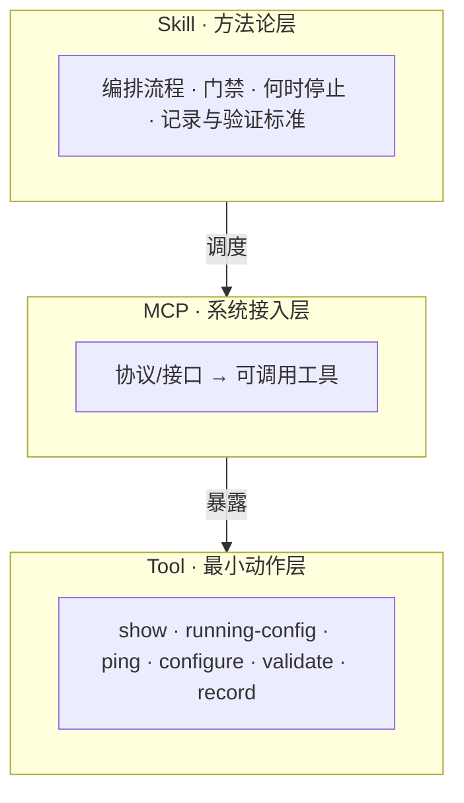

---

## 3. Cisco 网络变更流程：完整拆解

下面按真实变更链路来拆。

### 可视化：阶段 0～7 总览

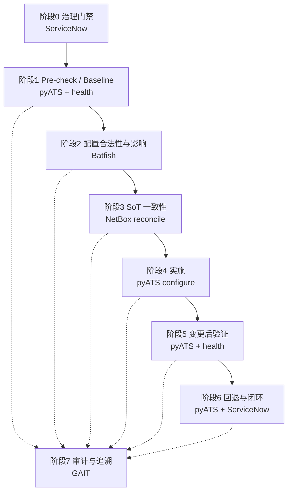

### 阶段 0：治理门禁

核心 skill：

- `workspace/skills/servicenow-change-workflow/SKILL.md`

核心作用：

- 检查是否存在 P1/P2 事件
- 检查是否有冲突变更
- 创建 Change Request
- 提交审批
- 必须等到 `Implement` 状态才允许执行

典型 tools：

- `list_incidents`
- `list_change_requests`
- `create_change_request`
- `add_change_task`
- `submit_change_for_approval`
- `get_change_request_details`
- `approve_change`
- `update_change_request`

这层的本质：

**先判断“能不能变更”，再讨论“怎么变更”。**

---

### 阶段 1：变更前网络状态检查（Pre-check / Baseline）

核心 skill：

- `workspace/skills/pyats-config-mgmt/SKILL.md`
- `workspace/skills/pyats-health-check/SKILL.md`

核心作用：

- 获取 running-config 基线
- 获取接口、路由、协议、ACL 等运行状态
- 获取关键连通性基线
- 获取设备健康状态

典型 tools：

- `pyats_show_running_config`
- `pyats_run_show_command`
- `pyats_ping_from_network_device`
- `pyats_show_logging`

典型检查对象：

- 接口状态
- 路由表
- OSPF/BGP 邻接
- ACL 命中
- CPU/内存
- NTP
- 日志异常
- 关键目标可达性

这层的本质：

**变更前先回答“当前网络是否健康、当前状态是什么”。**

---

### 阶段 2：配置合法性与影响分析

核心 skill：

- `workspace/skills/batfish-config-analysis/SKILL.md`

核心作用：

- 对拟变更配置做离线解析
- 检查配置是否可被解析
- 验证关键流量是否仍然可达
- 跟踪 ACL 命中路径
- 比较变更前后配置/路由/可达性差异
- 检查合规策略

典型 tools：

- `batfish_upload_snapshot`
- `batfish_validate_config`
- `batfish_test_reachability`
- `batfish_trace_acl`
- `batfish_diff_configs`
- `batfish_check_compliance`

这层的本质：

**把“经验评审”升级成“离线可验证评审”。**

---

### 阶段 3：SoT 一致性评审

核心 skill：

- `workspace/skills/netbox-reconcile/SKILL.md`

核心作用：

- 把 NetBox 设计意图与现网状态做对比
- 检查 IP、接口、链路、VLAN、状态、MTU 等漂移

典型 tools：

- `netbox_get_objects`
- `netbox_get_object_by_id`
- `netbox_search_objects`
- `netbox_get_changelogs`

配合 pyATS 工具：

- `pyats_run_show_command`

这层关注的问题：

- 当前方案是不是建立在真实、正确的网络事实之上
- 现网是不是已经与设计意图偏离

这层的本质：

**不是只评“命令对不对”，而是评“前提是不是对的”。**

---

### 阶段 4：实施执行

核心 skill：

- `workspace/skills/pyats-config-mgmt/SKILL.md`

核心作用：

- 按计划应用配置
- 逐步实施
- 避免一次打包多个无关变更

典型 tool：

- `pyats_configure_device`

典型执行原则：

- 一次做一个逻辑变更
- 不允许 destructive 操作
- 工具自身接管 `conf t / end`

这层的本质：

**实施动作必须被限制在明确、安全的边界之内。**

---

### 阶段 5：变更后验证

核心 skill：

- `workspace/skills/pyats-config-mgmt/SKILL.md`
- `workspace/skills/pyats-health-check/SKILL.md`

核心作用：

- 重新执行 pre-check 的关键命令
- 检查日志异常
- 检查配置是否按预期落地
- 检查协议和连通性是否符合预期

典型 tools：

- `pyats_show_running_config`
- `pyats_run_show_command`
- `pyats_show_logging`
- `pyats_ping_from_network_device`

这层的本质：

**验证不是“看起来没问题”，而是“和 baseline 成对比”。**

---

### 阶段 6：回退与闭环

核心 skill：

- `workspace/skills/pyats-config-mgmt/SKILL.md`
- `workspace/skills/servicenow-change-workflow/SKILL.md`

核心作用：

- 如果验证失败，按 inverse config 或 baseline 回退
- 在 ServiceNow 更新状态
- 必要时创建 incident

典型 tools：

- `pyats_configure_device`
- `update_change_request`
- `create_incident`

这层的本质：

**回退不是附加说明，而是变更设计的一部分。**

---

### 阶段 7：审计与追溯

核心 skill：

- `workspace/skills/gait-session-tracking/SKILL.md`

核心作用：

- 会话开始建 branch
- 每个关键动作记录 turn
- 会话结束输出 log
- 可 pin 基线/验证节点

典型 tools：

- `gait_branch`
- `gait_record_turn`
- `gait_log`
- `gait_show`
- `gait_pin`

这层的本质：

**保证 AI 的变更流程是可审计、可解释、可复盘的。**

---

## 4. tools 本身是怎么设计的

这是最值得给别人讲清楚的部分。

### 可视化：五维设计心智模型

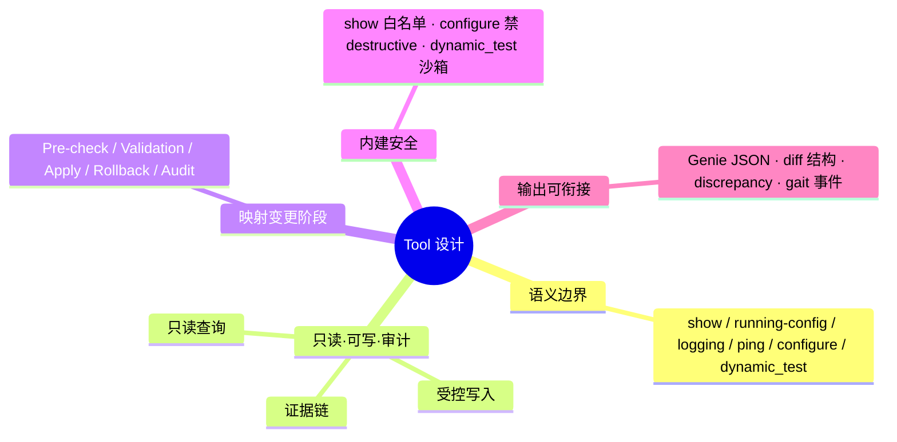

## 4.1 第一维：按语义边界拆 tool

这个仓没有做“大而全”的单一执行器，而是把能力拆开：

- `show` 查询
- `running-config` 获取
- `logging` 获取
- `ping` 连通性验证
- `configure` 写配置
- `dynamic_test` 纯验证逻辑

这样做的目的：

- 权限边界更清晰
- 风险边界更清晰
- 输出结构更稳定

---

## 4.2 第二维：按只读 / 可写分层

可以把 tools 分成三类：

### A. 只读查询类

例如：

- `pyats_run_show_command`
- `pyats_show_running_config`
- `pyats_show_logging`
- `batfish_validate_config`
- `batfish_diff_configs`
- `netbox_get_objects`

特点：

- 不改设备
- 适合评审、基线、诊断

### B. 受控写入类

例如：

- `pyats_configure_device`
- `create_change_request`
- `update_change_request`

特点：

- 允许写入
- 但必须被上层 skill 和流程约束

### C. 审计类

例如：

- `gait_record_turn`
- `gait_log`

特点：

- 不改网络
- 改的是证据链

### 可视化：只读 / 受控写入 / 审计

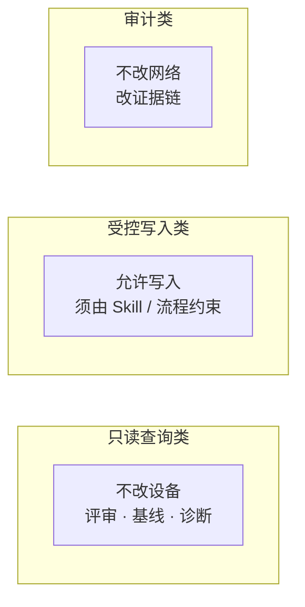

---

## 4.3 第三维：按阶段设计工具组

这个仓并不是把 tool 按技术模块简单堆起来，而是能映射到变更阶段：

- Pre-check tools
- Validation tools
- Apply tools
- Rollback tools
- Audit tools

这对培训别人非常重要：

**你不是在教“有哪些 tool”，而是在教“每个阶段该用哪组 tool”。**

### 可视化：工具组与变更阶段映射

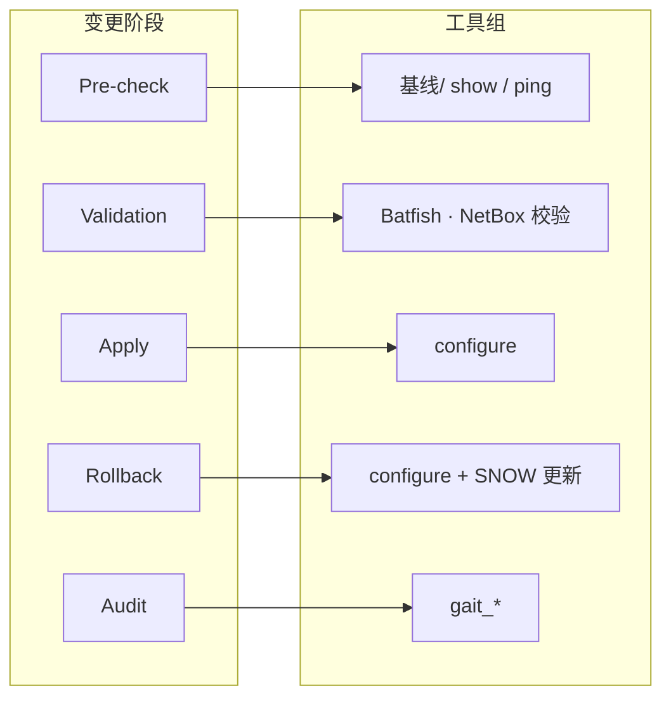

---

## 4.4 第四维：内建安全限制

以 `pyATS` 为例，安全限制主要体现在工具设计上：

### `pyats_run_show_command`

- 必须以 `show` 开头
- 不能有 pipe、redirect、shell 字符
- 不能包含 `copy / delete / erase / reload / write / configure`

### `pyats_configure_device`

- 不允许手动 `configure terminal`
- 不允许手动 `end`
- block 掉：
  - `write erase`
  - `erase`
  - `reload`
  - `delete`
  - `format`

### `pyats_run_dynamic_test`

- 禁止文件系统
- 禁止网络访问
- 禁止子进程
- 禁止 `eval/exec/open`
- 只能做纯校验

这说明它的设计思路是：

**不要把“安全”交给操作者自觉，而是直接体现在 tool 边界里。**

### 可视化：pyATS 相关工具的安全边界（示意）

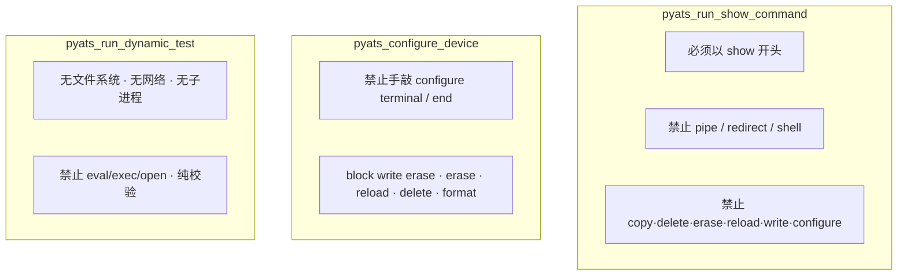

---

## 4.5 第五维：输出要能支撑后续流程

一个好 tool 不只是能执行动作，还要能给后续 skill 提供稳定输入。

例如：

- `pyats_run_show_command` 优先返回 Genie 结构化 JSON
- `batfish_diff_configs` 输出 route/reachability 差异
- `netbox-reconcile` 输出 discrepancy 类型和严重级别
- `gait_record_turn` 输出审计事件

这些输出都不是“给人看一眼就完了”，而是会继续被后续阶段使用。

---

## 4.6 `pyats-config-mgmt` 如何判断方案合理性

这是 Cisco 网络变更链路里一个很容易被误解的点。

`pyats-config-mgmt` **并不是一个独立的“智能规则评审器”**，它不会像静态代码分析器那样，单靠配置文本就自动证明“这个方案正确”。

它判断方案是否合理，主要依赖 5 个层次。

### 第一层：方案结构是否完整

在 `Phase 2: Plan the Change` 中，skill 明确要求变更方案必须回答 6 个问题：

- 改什么
- 为什么改
- 预期效果是什么
- 风险是什么
- 如何验证成功
- 如何回退

这意味着在这个 skill 语境下，一个“合理方案”首先必须是一个**结构完整的方案**。

如果这些内容说不清，方案即使命令本身看起来没错，也不能算成熟。

### 第二层：方案是否建立在现网基线之上

`pyats-config-mgmt` 要求先采集 pre-change baseline，再做任何实施：

- running-config 基线
- 受影响对象的状态基线
- 关键连通性基线

并且它会根据变更类型采不同数据：

- 接口类变更：接口状态、明细
- 路由类变更：路由表、OSPF/BGP 邻接
- ACL 类变更：访问控制列表
- 通用类：关键连通性

所以它的第二层判断逻辑是：

**一个合理方案，必须知道“当前网络是什么状态”，而不是脱离现网拍脑袋写配置。**

### 第三层：方案是否符合实施最佳实践

这个 skill 虽然不是形式化规则引擎，但给出了非常明确的实施 best practices：

- 一次只做一个逻辑变更
- 不把无关变更混在一起
- 工具自己接管 `conf t / end`
- 复杂对象（如 route-map、ACL）要先完整构建，再应用到接口/邻居
- 接口、route-map 等对象要具备可读性和描述

这意味着它会把下面这些情况视为低质量方案：

- 批量夹带多个无关变更
- 配置上下文切换混乱
- 对象还没建完整就先引用
- 缺少清晰描述和边界

所以第三层判断逻辑是：

**方案不只是“能下发”，还要“像一个受控、可运维的方案”。**

### 第四层：方案是否兑现了预期效果

真正关键的判断发生在 `Phase 4: Post-Change Verification`：

- 检查日志是否出现异常
- 检查配置是否按预期落地
- 重新执行基线命令，确认状态变化符合预期
- 重新执行关键连通性测试，与 baseline 对比

所以 `pyats-config-mgmt` 最终不是靠“纸面上看起来没问题”来判断合理性，而是靠：

- 是否只产生了预期的配置变化
- 是否出现了预期的新状态
- 是否没有破坏原有关键能力
- 是否没有引入异常日志和连通性下降

也就是说：

**它把“方案合理性”落到“结果是否正确、是否无副作用”上。**

### 第五层：方案是否可回退

在这个 skill 里，rollback 不是附加说明，而是方案合理性的组成部分。

它明确要求：

- 有 inverse config 或 baseline 可恢复路径
- 失败后要回退
- 回退后要重新验证是否回到 baseline 状态

因此，一个没有回退方案、没有恢复验证路径的变更，在这个 skill 的逻辑里并不算真正合理。

### 总结

所以更准确地说：

`pyats-config-mgmt` 判断“方案是否合理”，并不是通过一个静态评分器，而是通过下面这 5 件事的组合：

1. 方案结构完整
2. 建立在现网基线之上
3. 符合实施最佳实践
4. 变更后验证兑现预期
5. 具备回退与恢复能力

### 可视化：`pyats-config-mgmt` 五层判断逻辑

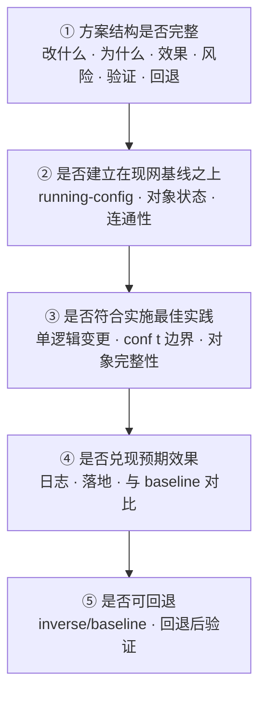

### 可视化：与周边 skill 的分工（非独立“静态评审引擎”）

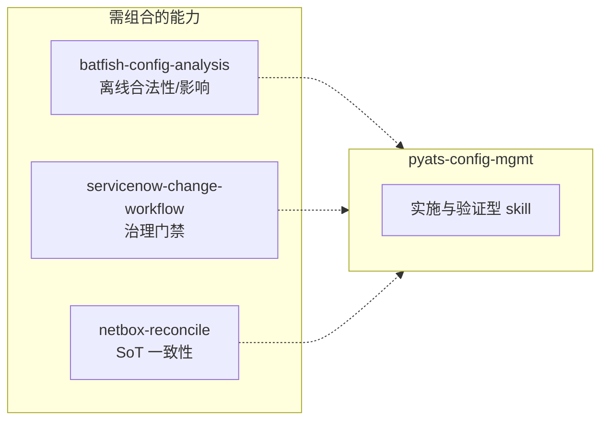

如果要做更强的“方案合法性/影响分析”，这个 skill 本身并不独立完成，而是要结合：

- `batfish-config-analysis` 做离线验证
- `servicenow-change-workflow` 做治理门禁
- `netbox-reconcile` 做 SoT 一致性校验

所以 `pyats-config-mgmt` 更准确的定位是：

**它是一个“实施与验证型变更 skill”，而不是单独的离线静态评审引擎。**

---

## 4.7 `batfish_diff_configs` 这个 tool 具体怎么干

如果说 `pyats-config-mgmt` 解决的是“现网实施与验证”，那么 `batfish_diff_configs` 解决的是另一个问题：

**变更前后的网络行为，到底发生了什么变化。**

它的实现位置在：

- `mcp-servers/batfish-mcp/batfish_mcp_server.py`

工具定义是：

- `reference_snapshot`
- `candidate_snapshot`
- `include_routes`
- `include_reachability`
- `network`

这个 tool 的工作方式，不是做简单的配置文本 diff，而是分两条线做结构化比较：

1. 路由结果差异
2. 可达性结果差异

### 可视化：`batfish_diff_configs` 执行顺序与两条分析线

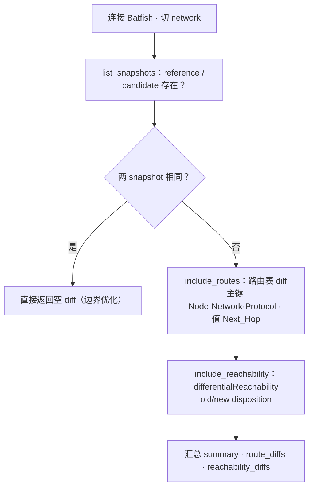

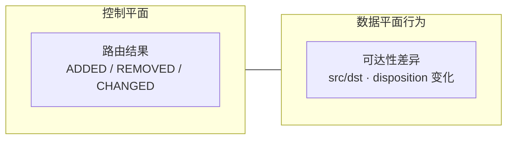

### 第一步：切到 Batfish network 并检查 snapshot 是否存在

函数开始时会先连接 Batfish 会话，并切到目标 `network`。

随后它会调用 `list_snapshots()` 检查：

- `reference_snapshot` 是否存在
- `candidate_snapshot` 是否存在

如果任何一个 snapshot 不存在，就直接返回 `SNAPSHOT_NOT_FOUND`，不会继续分析。

这说明这个 tool 的第一层设计思路是：

**先保证比较对象是合法的，再做后续推理。**

### 第二步：如果两个 snapshot 相同，直接返回“无差异”

如果 `reference_snapshot == candidate_snapshot`，函数不会再去执行路由或可达性分析，而是直接返回：

- 空的 `route_diffs`
- 空的 `reachability_diffs`
- `added/removed/changed` 全为 0

这一步看起来简单，但对培训很有价值，因为它体现了一个很清楚的工程习惯：

**先处理显式的边界场景，避免把“没有变化”误判成“分析失败”。**

### 第三步：做路由差异比较

当 `include_routes=True` 时，这个 tool 会分别读取两个 snapshot 的路由表：

- 在 `reference_snapshot` 上执行 `bf.q.routes().answer().frame()`
- 在 `candidate_snapshot` 上再次执行 `bf.q.routes().answer().frame()`

然后它不是直接逐行比对，而是先构造一套路由主键：

- `Node`
- `Network`
- `Protocol`

再把 `Next_Hop` 作为比较值。

也就是说，它关心的是：

- 同一台设备上
- 同一个前缀
- 同一种路由来源
- 下一跳有没有变化

最终会把差异归成三类：

- `ADDED`
- `REMOVED`
- `CHANGED`

这层的本质不是“配置有没有不同”，而是：

**控制平面的结果有没有不同。**

例如：

- 某条路由在新方案里消失了
- 某条路由在新方案里新增了
- 某条路由还在，但下一跳已经变化

对割接评审来说，这一层非常关键，因为很多风险并不体现在命令文本，而体现在最终路由结果上。

### 第四步：做差分可达性分析

当 `include_reachability=True` 时，它会把：

- `candidate_snapshot` 设为当前分析对象
- `reference_snapshot` 设为 reference snapshot

然后执行 `differentialReachability()`。

这个查询的含义不是“配置有哪里改了”，而是：

**在变更前后，哪些流量的处理结果发生了变化。**

函数会从 Batfish 返回结果里提取：

- `src_ip`
- `dst_ip`
- `old_disposition`
- `new_disposition`

所以最终关注的是这种变化：

- 原来可达，现在不可达
- 原来是 `ACCEPTED`，现在变成 `DENIED`
- 原来被某种 disposition 处理，现在换成另一种 disposition

这也是为什么 `batfish_diff_configs` 比普通文本 diff 更适合做割接评审。

因为它直接回答的是：

**这次方案会不会改变真实流量的命运。**

### 第五步：汇总输出并形成摘要

路由差异分析完成后，函数会统计：

- 新增路由数
- 删除路由数
- 变化路由数
- 可达性变化条数

最后统一输出：

- `reference_snapshot`
- `candidate_snapshot`
- `route_diffs`
- `reachability_diffs`
- `summary`
- `timestamp`

同时它还会写一条 GAIT 风格的摘要日志，类似：

- `Routes: +X -Y ~Z | Reachability: N changes`

这说明它的输出不是只给人眼看，而是可以继续被上层 skill 当作结构化证据使用。

### 这个 tool 真正解决的，不是“文本差异”，而是“行为差异”

这一点最值得在培训里讲清楚。

很多人第一次看到 `batfish_diff_configs`，会以为它只是：

- 对比变更前后配置文件

但从实现上看，它做的其实是：

- 路由结果差异分析
- 可达性结果差异分析

所以更准确地说，它是一个：

**离线变更影响分析器**。

而不是一个简单的配置 diff 工具。

### 这个实现也有边界

从代码实现上看，它也不是“全能评审器”，主要有 3 个边界：

1. 路由比较维度相对保守，主要比较 `Node + Network + Protocol + Next_Hop`，不是所有 route attribute 都会细比。
2. `differentialReachability()` 如果查询异常，这里会记 warning，但不会把整个工具强制失败。
3. 它只能告诉你“变了什么”，不能独立判断“这种变化是不是业务上可接受”。

所以在真实流程里，它通常要和下面几类能力联动：

- `pyats-config-mgmt`：验证现网实施前后状态
- `servicenow-change-workflow`：做治理门禁
- `netbox-reconcile`：检查设计意图是否一致

### 小结

如果要用一句话向别人解释 `batfish_diff_configs`，我建议这样讲：

**它先确认两个快照合法存在，再比较两边的路由结果和流量可达性结果，最后把“新增/删除/变化”的结构化影响输出出来，用于割接前的离线影响评审。**

---

## 5. Cisco 网络变更链路里的主要技能与路径

下面给一份讲解时可直接引用的“核心路径索引”。

### 可视化：按主题的 skill / 代码路径（分类索引，非执行顺序）

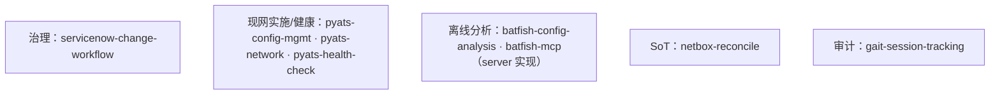

### 变更治理

- `workspace/skills/servicenow-change-workflow/SKILL.md`

### 变更实施与验证

- `workspace/skills/pyats-config-mgmt/SKILL.md`
- `workspace/skills/pyats-network/SKILL.md`
- `workspace/skills/pyats-health-check/SKILL.md`

### 离线配置分析

- `workspace/skills/batfish-config-analysis/SKILL.md`
- `mcp-servers/batfish-mcp/batfish_mcp_server.py`
- `mcp-servers/batfish-mcp/README.md`

### SoT 对账

- `workspace/skills/netbox-reconcile/SKILL.md`

### 审计

- `workspace/skills/gait-session-tracking/SKILL.md`

---

## 6. 如果你要给别人讲，这一套该怎么讲

建议不要从“这个仓有多少个 MCP / tools”开始讲，而是从“网络变更流程”讲。

推荐讲法：

### 先讲业务流程

- 变更前要不要做
- 变更前网络是否健康
- 方案是否合法
- 实施怎么做
- 实施后怎么验证
- 失败怎么回退
- 全过程怎么审计

### 再映射到技术层

- `ServiceNow skill` 解决治理问题
- `pyATS skill` 解决现网状态与实施问题
- `Batfish skill` 解决离线合法性问题
- `NetBox skill` 解决意图一致性问题
- `GAIT skill` 解决审计问题

### 最后再落到 tools

- `show`
- `config`
- `ping`
- `validate`
- `diff`
- `reconcile`
- `record`

这样别人最容易理解。

### 可视化：推荐讲解顺序（业务 → 技术 → 原子能力）

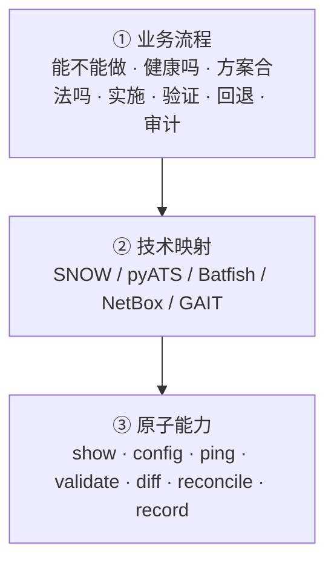

---

## 7. 最重要的启发

这个仓对“Cisco 网络变更”最有价值的设计，不是它接了多少平台，而是它把变更做成了一个标准化工作流：

- 有治理门禁
- 有现网基线
- 有离线分析
- 有 SoT 校验
- 有实施和验证
- 有回退
- 有审计

一句话说：

**在这个仓里，网络变更不是一条命令，而是一条被 Skill 编排、被 MCP 承载、被 Tool 落地的完整业务链路。**

### 可视化：标准化工作流要素

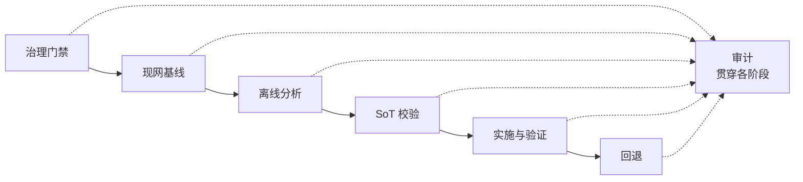

---

## 8. 后续可继续补充的方向

如果要继续把这份文档做成培训材料，建议下一步补：

- 每个阶段的示例输入/输出
- 每个 tool 的只读/可写/高风险分级
- 一个完整变更案例的时序图
- 一份“割接方案评审 checklist”
