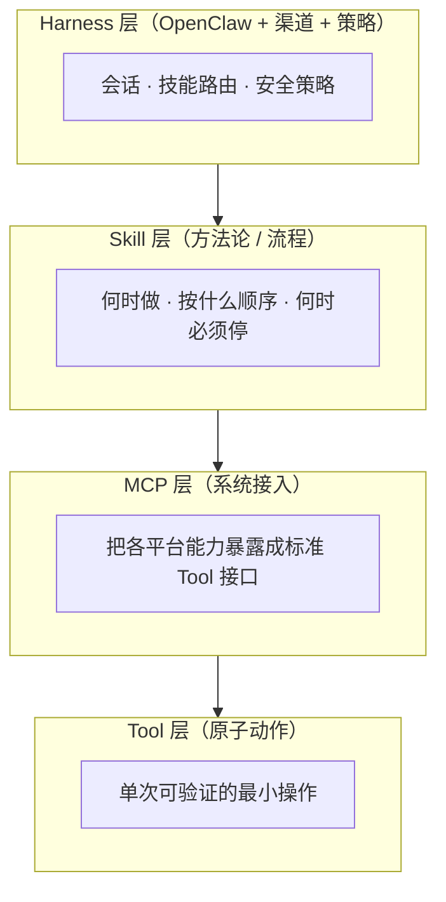
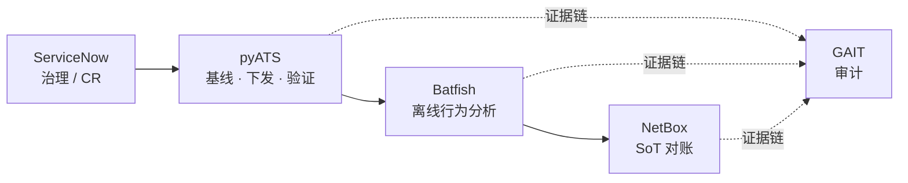

# NetClaw 技术原理随笔：从 Harness 工程到网络变更

> 面向希望理解「AI 网络工程体」如何落地的人：先谈 **Harness Engineering**，再以 **网络变更** 为主线，说明 NetClaw 如何用 **Skill / MCP / Tool** 分层把事做对、做可审计。

---

## 一、为什么先谈 Harness Engineering，而不是「提示词」

大模型本身不会「连到你的交换机」，也不会自动遵守贵司的变更审批制度。真正决定**能否在生产里长期跑**的，往往是模型之外的**整套约束与编排**——业界常把这种「套在模型外面的工程」叫作 **Agent Harness**（或广义的 **AI Harness**）：路由决策、工具权限、流程门禁、观测与审计，都在这里完成。

可以粗略理解为三层分工：

| 层次 | 在解决什么问题 |
|------|----------------|
| **模型** | 语言理解与推理、在候选动作间做选择 |
| **Harness** | 何时能调用什么、如何分解任务、如何失败重试、如何与人类/工单系统对齐 |
| **世界** | 真实设备、ITSM、SoT、观测平台——只通过受控接口交互 |

**Harness Engineering** 就是把 Harness **当作一等公民来设计**：不是事后打补丁，而是从**安全边界、可组合能力、可观测性**出发定义系统行为。NetClaw 选择的路径是：在 [OpenClaw](https://github.com/openclaw/openclaw) 这类 Agent 运行时之上，用 **Skill（方法论）+ MCP（系统接入）+ Tool（原子动作）** 把网络运维与变更「产品化」，而不是把「写一段 prompt」当成方案。

---

## 二、NetClaw 在工程上「怎么搞」的：一张总图

NetClaw 是跑在 OpenClaw 上的 **CCIE 级网络工程 coworker**（见仓库内 `SOUL.md` / `README.md`）。规模上，当前仓库对外描述为 **约 101 个 Skills**、**约 46 个 MCP 集成**——数字会随版本迭代，但**架构分层**是稳定的：

三句话记住分工：

1. **Skill**：教智能体「**怎么做**」——流程、检查点、与变更治理对齐的叙述与约束。  
2. **MCP（Model Context Protocol）Server**：教系统「**连哪里**」——把 ServiceNow、pyATS、NetBox、Batfish、GAIT 等变成模型可调用的工具集合。  
3. **Tool**：教执行「**做什么**」——一次 `show`、一次受控 `configure`、一次离线校验，粒度小到可以单独授权、测试与审计。

这和「写一个巨型万能脚本」的区别在于：**推理在模型里，边界在 Harness + Tool 里**——后者才是企业网络里最值钱的部分。

---

## 三、从「变更」切入：NetClaw 构建了哪些能力、如何分类

网络变更不是单点命令，而是一条**带门禁、基线、验证、回退与审计**的链路。NetClaw 不是做一个「网络变更总工具」，而是把链路拆到不同层，由 Skill 编排、MCP 承载、Tool 落地（与 `docs/cisco-network-change-flow-analysis.md` 中的拆解一致）。

### 3.1 变更主路径（概念）

典型 Cisco 侧路径可以概括为：

**ServiceNow（治理）→ pyATS（基线 / 下发 / 验证）→ Batfish（离线影响）→ NetBox（SoT 对账）→ GAIT（审计）**

各段对应的**能力类型**如下表（便于和下文 Skill/MCP 对照）。

| 阶段关注点 | 主要 Skill 方向 | 典型 MCP | Tool 在干什么 |
|------------|-----------------|----------|----------------|
| 能不能改、工单是否到位 | `servicenow-change-workflow` | ServiceNow MCP | 列事件/变更、建 CR、提交审批、查状态 |
| 现网是否健康、基线是否采集 | `pyats-config-mgmt`、`pyats-health-check` | pyATS MCP | `show`、running-config、ping、logging |
| 方案离线是否「行为上」安全 | `batfish-config-analysis` | Batfish MCP | 快照、校验、可达性、diff |
| 意图与现网是否一致 | `netbox-reconcile` | NetBox MCP | 查询对象、差异类输出 |
| 全过程可复盘 | `gait-session-tracking` | GAIT MCP | branch、record_turn、log |

### 3.2 分类法一：按 **Skill** 主题（给人看的「工作流地图」）

Skill 在仓库里以 `workspace/skills/<name>/SKILL.md` 存在，可按**领域**粗分为（与 `README` / `SOUL` 中的列举一致，此处只强调与变更相关的子集）：

- **治理与 ITSM**：如 `servicenow-change-workflow`（CR 全生命周期与审批门禁）。  
- **设备自动化（pyATS 族）**：如 `pyats-network`、`pyats-config-mgmt`、`pyats-health-check`、`pyats-parallel-ops` 等——变更场景里最核心的是 **config-mgmt + health**。  
- **SoT 与对账**：如 `netbox-reconcile`（以及组织若用 Nautobot/Infrahub 时的对应 skill）。  
- **离线分析**：如 `batfish-config-analysis`。  
- **审计**：`gait-session-tracking`（Git 化、不可抵赖的操作轨迹）。

这类分类回答的是：**培训与排错时「先打开哪份 SKILL」**，而不是「底层 TCP 连了谁」。

### 3.3 分类法二：按 **MCP**（给系统看的「连接器地图」）

MCP Server 把外部系统的 API/协议封装成 **统一 Tool 清单**。变更链路里常见对应关系包括：

- **pyATS MCP**：SSH/自动化会话、Genie 解析、受控配置通道。  
- **ServiceNow MCP**：工单与流程状态。  
- **Batfish MCP**：离线转发/路由/可达性推理。  
- **NetBox MCP**：资源与意图数据。  
- **GAIT MCP**：会话级审计事件。

**分类维度**可以是：按**厂商/系统**（Cisco vs ITSM vs SoT）、或按**读写风险**（只读监控 vs 受控写入）。NetClaw 的整体倾向是：**读写分离、高风险动作收窄到少量 Tool，并由 Skill 强制顺序**。

### 3.4 分类法三：按 **Tool**（给安全与测试看的「原子能力」）

Tool 是最小执行单元，常见设计维度包括：

1. **语义边界**：`show`、`running-config`、`ping`、`configure` 分拆，而不是一个「万能 CLI」。  
2. **只读 / 受控写 / 审计**：查询类、写入类（需 CR 与 Skill 门禁）、仅写审计链路的 `gait_*`。  
3. **映射变更阶段**：Pre-check、Validation、Apply、Rollback、Audit 各阶段对应不同工具组。  
4. **内建安全**：例如对 `show` 的白名单、对 `configure` 禁止 destructive 关键字等——**安全默认写在工具边界上，而不是依赖操作者自觉**（详见仓库内 pyATS MCP 设计与 `pyats-config-mgmt` skill）。

这样分类的好处是：**做权限模型、做渗透测试、做回归测试时，都有清晰清单**。

---

## 四、Harness 视角下的一句话总结

- **Harness Engineering** 关心的是：模型之外的**策略、编排、工具边界与证据链**。  
- **NetClaw** 用 **Skill / MCP / Tool** 把网络变更拆成可组合、可治理、可审计的链路；数字上会随版本变化（当前公开表述为约 **101 Skills**、**46 MCP**），但**分层逻辑**是稳定资产。  
- 若你要对外讲解，建议顺序是：**先讲变更业务链路，再映射到 Skill，再落到 MCP 与 Tool**——与「先背工具清单」相比，听众更容易建立心智模型。

---

## 参考与延伸阅读

- 仓库内变更拆解：`docs/cisco-network-change-flow-analysis.md`  
- 项目总览与集成列表：`README.md`  
- Agent 身份与能力边界：`SOUL.md`  

---

*本文档为技术分享性质，具体 Skill 名称与 MCP 数量以当前仓库版本为准。*
